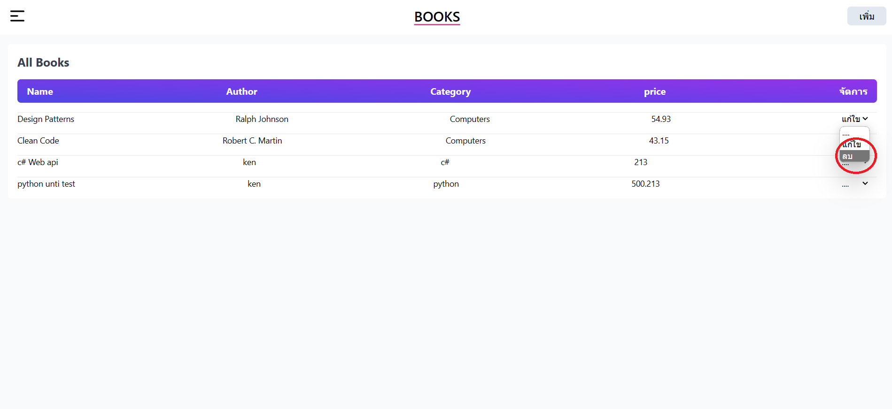

# MiniProject BooksStore

7153315 การเขียนโปรแกรมแบบวิชวล ผู้ช่วยศาสตราจารย์ สมเกียรติ ช่อเหมือน

## Pages All

### Login Page


### Register Page


### Register success Page


### Home Page


### My information Page


### MangeUser (View) Page


### MangeUser (Update) Page


### MangeUser (Delete) Page


### MangeBooks (View and new) Page


### MangeBooks (View and update) Page


### MangeBooks (View and delete) Page



### All link Page


### 404 Page


# Setup server By .net webapi

A brief description of your .NET API project.

## Table of Contents

- [Getting Started](#getting-started)
  - [Prerequisites](#prerequisites)
  - [Installation](#installation)
- [API Endpoints](#api-endpoints)

## Getting Started

Provide information on how to set up and run your .NET API. Include details on prerequisites and installation.

### Prerequisites

List any prerequisites that are necessary to set up your project. For example, you might mention:

- [.NET SDK](https://dotnet.microsoft.com/download) (version X.X.X)
- [Visual Studio](https://visualstudio.microsoft.com/) (optional)

### Installation

A step-by-step guide on how to install and run the project. This could include cloning the repository, setting up the database, and running the application.

```bash
# Clone the repository
git clone https://github.com/sekkarin/VS--mini-project-bookStore/tree/main/BookStoreApi

# Change directory
cd your-project

# run the application
dotnet run --launch-profile http
# run the dev
dotnet watch --no-hot-reload
```

## API Endpoints

http://localhost:5098/swagger/index.html


# Setting Up MongoDB with Docker

This guide will help you set up a MongoDB database using Docker containers.

## Prerequisites

Before you start, ensure you have Docker installed on your system. If Docker is not installed, you can download and install it from the official website: [Docker Installation Guide](https://docs.docker.com/get-docker/).

## Getting Started

### 1 Start MongoDB with Docker Compose

Open your terminal, navigate to the directory containing your docker-compose.yml file, and run the following command:

```bash
docker-compose up -d
```


Your MongoDB container should now be up and running.

### 2 DBMS mongodb express

mongo-express is a web-based MongoDB admin interface written in Node.js, Express.js, and Bootstrap3.

http://localhost:8081/


### 3 Stopping and Removing the Containers

If you need to stop and remove the MongoDB container created with Docker Compose, use the following commands:

```bash
docker-compose down
```

# Setup the React Frontend

A brief description of your Vite React project.


## Getting Started

Provide information on how to set up and run your Vite React project. Include details on prerequisites, installation, and cloning the project from Git.

### Prerequisites

List any prerequisites that are necessary to set up your project. For example, you might mention:

- [Node.js](https://nodejs.org/) (version X.X.X)
- [npm](https://www.npmjs.com/) or [Yarn](https://yarnpkg.com/) (version X.X.X)
- [Git](https://git-scm.com/)

### installationReact

If your project requires specific dependencies or setup, explain how to install them:

```bash
# Clone the repository
git clone https://github.com/sekkarin/VS--mini-project-bookStore/tree/main/bookStore-fronend

# Change directory
cd your-project
# Using npm
npm install

# Using Yarn
npm run dev
```
